# 1.项目介绍
- 系统角色：管理员、教师、学生
- 功能模块：学生管理、教师管理、任务信息管理、报名信息管理、任务排名管理、学习资料管理、每日打卡、交流论坛、积极分子管理、党员信息管理等
- 技术选型：SpringBoot，Vue（后端管理web），uniapp等
- 测试环境：idea2024，jdk1.8，mysql5.7，maven3，node14.16.1，HbuilderX，微信开发工具
# 2.项目部署
## 2.1 后端
- 创建数据库，导入sql文件
- idea打开项目，根据本地数据库环境修改src/main/resources/application.yml 11-14行
- 启动项目，src/main/java/com/SpringbootSchemaApplication.java
- 打开idea（安装vue.js插件）的终端， cd .\src\main\resources\admin\admin\， 输入 npm install
- 安装成功后，运行项目：npm run serve
- 后端管理web：http://localhost:8080/springbootvww33/admin/dist/index.html   管理员账号密码：abo/abo
- 说明：vue项目是src/main/resources/admin/admin，若果你不想给idea安装vue插件，你也可以通过vscode或者webstorm去打开vue项目进行安装启动
## 2.2 小程序
- 通过微信开发工具，打开项目mp-weixin
- appid配置为你自己小程序的，或者你自己申请的测试小程序appid
- 信任项目即可，如果页面空白，重新编译下
- 登录账户自行查表
- 说明：mp-weixin是uniapp项目编译后的，如果你想对小程序做一些修改，你可以通过HbuilderX打开src/main/resources/front/front，这个是uniapp项目
# 3.项目部分截图

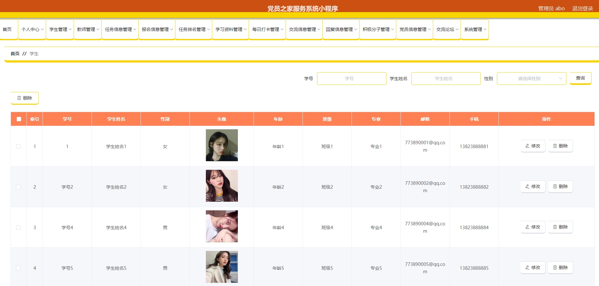
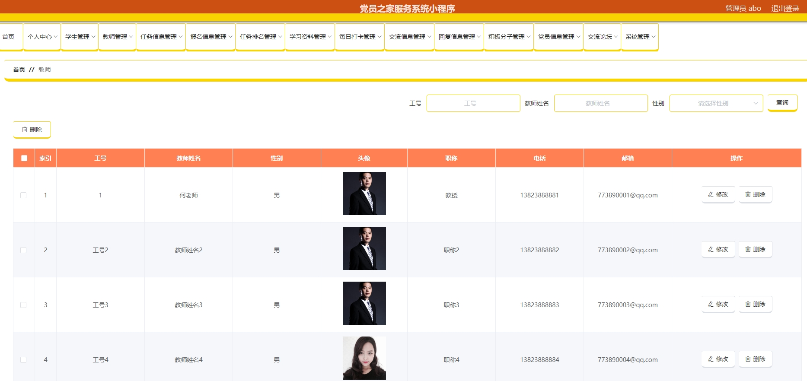
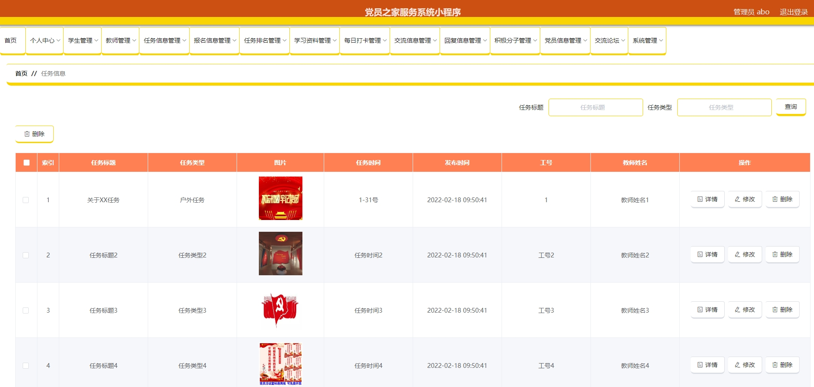
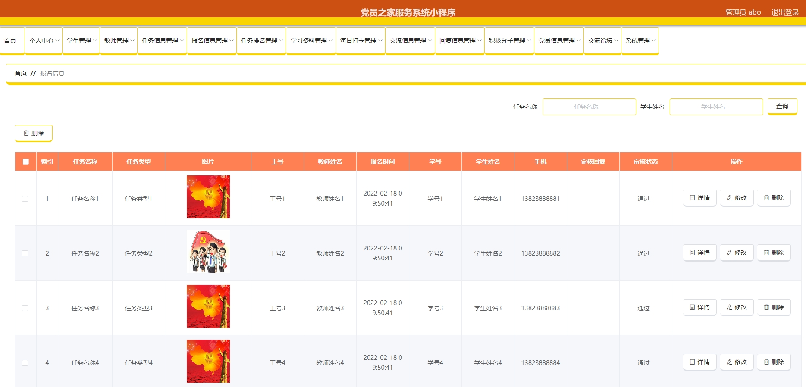
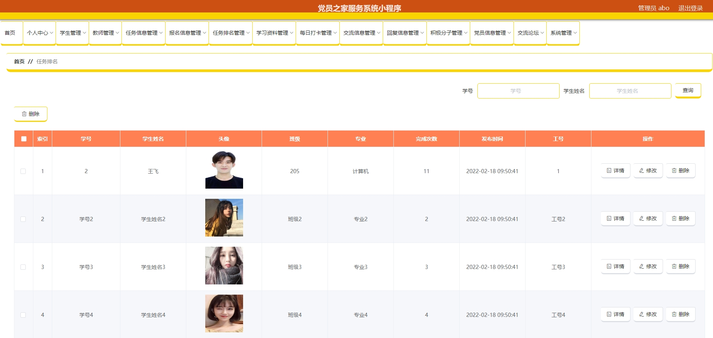
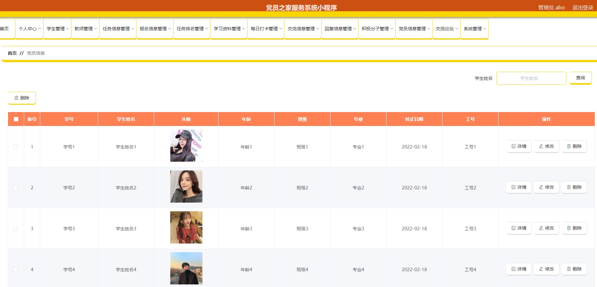
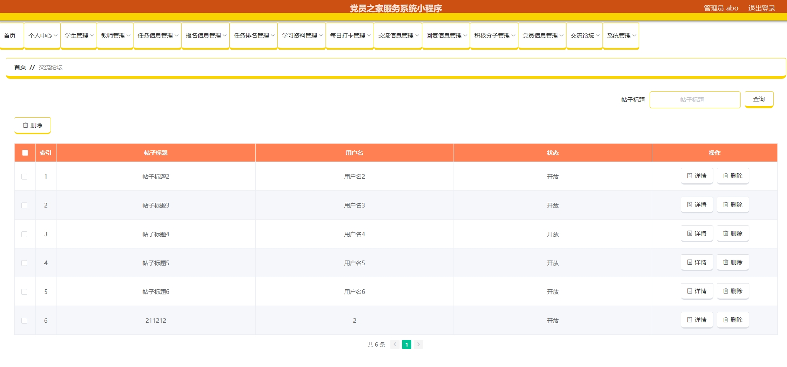
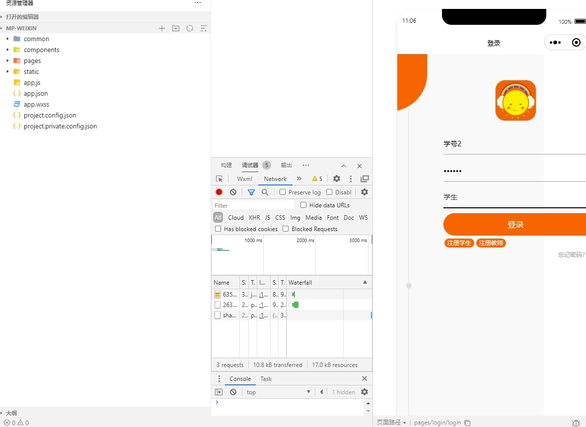
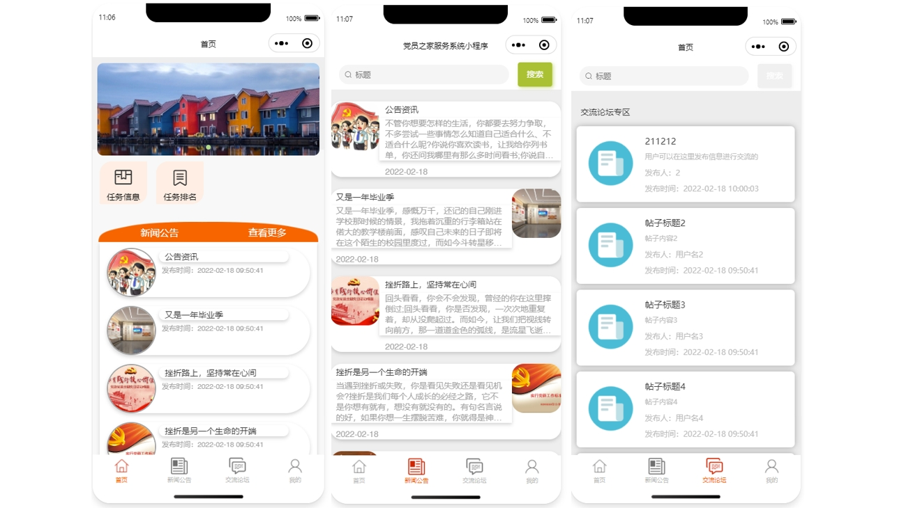
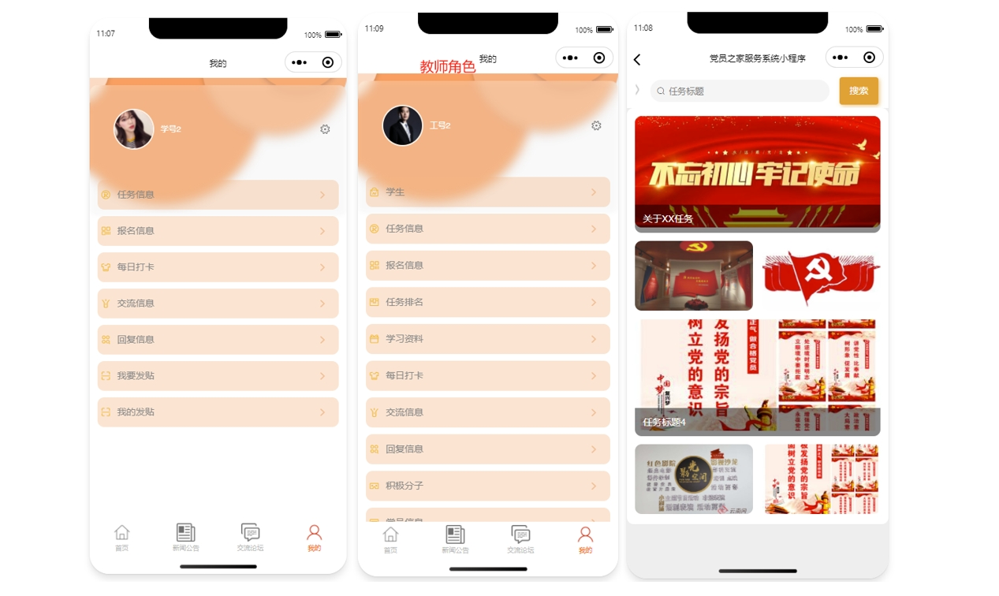
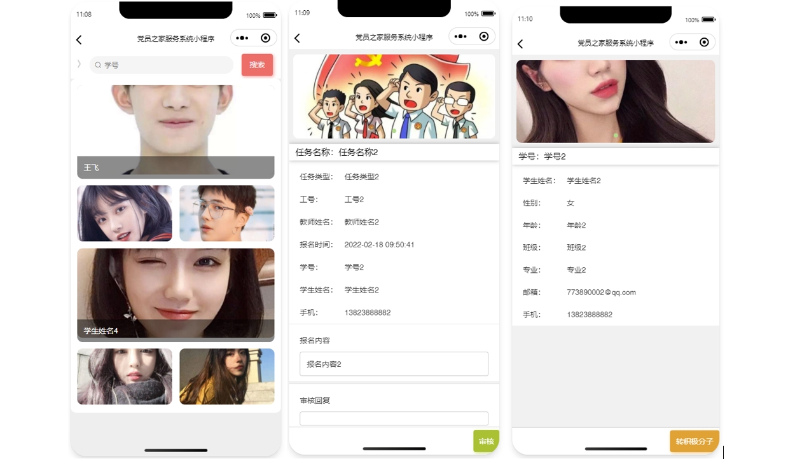
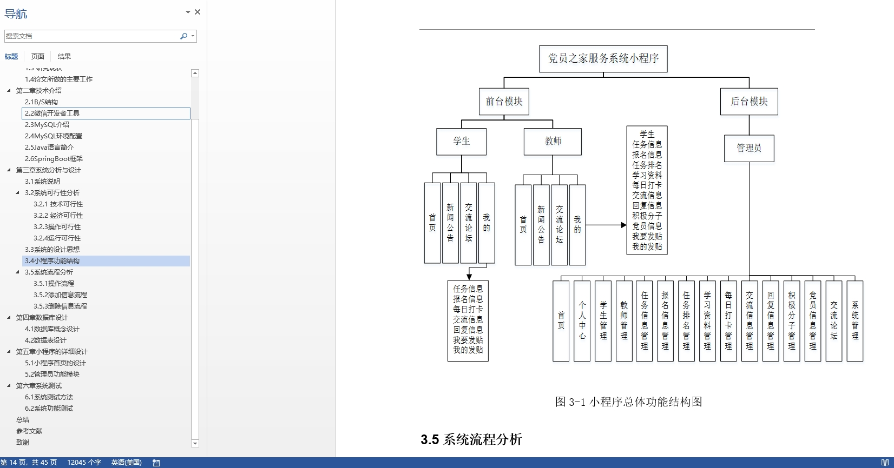

# 4.获取方式
[戳我查看](https://gitee.com/aven999/mall)
